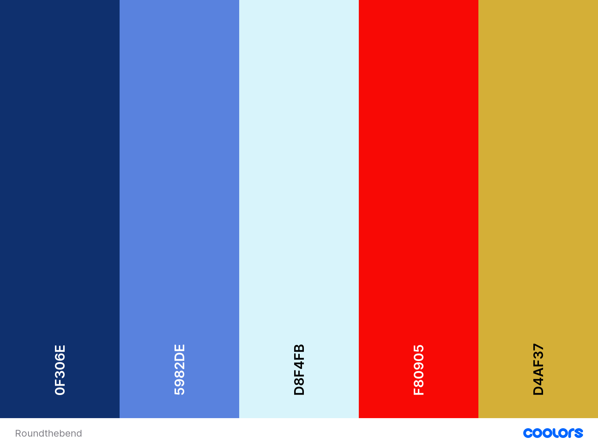

<h1 align="center">Round the Bend</h1>

[View the live project here.](https://msierag.github.io/MS1_Round_the_Bend/)

## Purpose of the website

This is the website for the fictional organisation Round the Bend. The purpose of this website is to provide the biker community with a location to share gps routes. It is designed to be responsive and accessible on a range of devices, making it easy to navigate for potential users.

<h2 align="center"></h2>

## User Experience (UX)

-   ### User stories

    -   #### Visiting User Goals

        1. As a visiting user, I want to easily understand the main purpose of the site. 
        2. As a visiting user, I want to be able to easily navigate throughout the site to find content.
        3. As a visiting user, I want to locate their social media links to see their followings on social media to determine how trusted and known they are.
        4. As a visiting user, I want to find the best way to get in contact with the organisation with any questions I may have.
        5. As a visiting user, I want to be able to view the details of the routes.
        6. As a visiting user, I want to be able to download the gps files for the route of my choice.
        7. As a visiting user, I want to be able to submit routes.
        8. As a visiting user, I want to sign up to the Newsletter so that I am emailed any major updates and/or changes to the website or organisation.

-   ### Design
    -   #### Colour Scheme
        -   There are five colours used throughout the site, the first three are main colours and the remaining two are used for accents.
                
            The colours #0F306E, #5982DE and F80905 were chosen as they approach the palette of the decals on the 1988 Honda Transalp 600, an iconic enduro motorcycle. The colour #D4AF37 was chosen as an accent colour as it resembles the colour of many motorcycle brake calipers. Finally, #D8F4FB was added as a transition colour to soften the vibrant palette where needed. 
    -   #### Typography
        -   The Domine font is the main font used throughout the whole website with Fira Sans, Raleway and ultimately Sans Serif as the fallback fonts in case for any reason the font isn't being imported into the site correctly. Domine is a serif font which was designed for body text on the web and is friendly on the eyes.
    -   #### Imagery
        -   Imagery is important. The large, background hero image is designed to be striking and catch the user's attention. It puts the user in the position of a biker in the driver's seat. The three images used in the Explore, Connect and Inspire sections of the Home page capture the gist of the text. The image at the top of the Routes page represents the sense of adventure and freedom typically associated with riding a motorcycle. 

*   ### Wireframes

    -   Home page wireframe - [View](./assets/images/wireframes/rtbhome.png)

    -   Routes page wireframe - [View](./assets/images/wireframes/rtbroutes.png)

    -   Contact page wireframe - [View](./assets/images/wireframes/rtbcontact.png)

    -   Uploads page wireframe - [View](./assets/images/wireframes/rtbuploads.png)

    -   Mobile wireframes - [View](./assets/images/wireframes/rtbsmartphone.png)

    -   Tablet wireframes - [View](./assets/images/wireframes/rtbtablet.png)

## Features

### Existing features

#### Features across all pages

-   Navigation bar which remains fixed at the top of the page. It makes for easy and consistent navigation throughout the site. The current page is highlighted dark.

-   Footer which appears on every page and stays at the bottom. The footer contains:

       - the statement that this website is for educational purposes only.

       - newsletter sign-up button. The colours on the button are inverted when the user hovers over it. When selected, a modal pop-up appears allowing the user to submit their email address.

       - social media icons. When the user hovers over an icon it appears darker against the background. When selected the icons provide a link to the relevant social medium in a separate page.

#### Page specific features

##### Home page

-   Hero image which virtually puts the user in the driver's seat with a view across the handlebars. 

-   Callout on the hero image which informs the user of the purpose of the site through the slogan "Routes for bikers, by bikers".

-   Scrolling mouse wheel animation to direct the user to scroll down to the content initially hidden from view by the hero image.

-   Content section containing three cards with statement headings and minimal text aimed to elicit an emotional response. 

-   Call to action buttons which reiterate the statement headings and when selected land the user on the appropriate page on the website.  

##### Routes page

-   Heading image which conveys the sense of adventure and freedom typically associated with riding a motorcycle. The image is deliberately not full-width nor full view height so as not to obscure the content section or require a scroll invitation.

-   Content section consisting of cards with the details of the routes on offer, arranged by country.  

-   Each route card contains a call to action button to download the gpx file. When selected the download opens on a separate tab. 

##### Contact page

-   Contact Us column contains a form which allows the user to submit their questions or remarks to the organisation. 

##### Uploads page

-   Form which allows the user to submit their own route to the organisation.  

### Future features

-   A login procedure to register users. 
-   Search function on the Routes page. 
-   Small map of the route to be displayed above the heading of the route. 
-   Indication of "New" to appear next to routes which were added since a registered user's last visit. Unregistered users/visitors would not see this indication.

## Technologies Used

### Languages Used

-   [HTML5](https://en.wikipedia.org/wiki/HTML5)
-   [CSS3](https://en.wikipedia.org/wiki/Cascading_Style_Sheets)

### Frameworks, Libraries & Programs Used

1. [Bootstrap 4.4.1:](https://getbootstrap.com/docs/4.4/getting-started/introduction/)
    - Bootstrap was used to assist with the responsiveness and styling of the website.
1. [Google Fonts:](https://fonts.google.com/)
    - Google fonts were used to import the 'Domine', 'Raleway' and 'Fira Sans' fonts into the style.css file which are used throughout the project.
1. [Font Awesome:](https://fontawesome.com/)
    - Font Awesome was used to add the social media icons to the footer.
1. [jQuery:](https://jquery.com/)
    - jQuery came with Bootstrap to make the navbar responsive but was also used for the smooth scroll function in JavaScript.
1. [Git](https://git-scm.com/)
    - Git was used for version control by utilizing the Gitpod terminal to commit to Git and Push to GitHub.
1. [GitHub:](https://github.com/)
    - GitHub is used to store the projects code after being pushed from Git.
1. [Balsamiq:](https://balsamiq.com/)
    - Balsamiq was used to create the [wireframes](https://github.com/) during the design process.
1. [TinyJPG](https://tinyjpg.com/) 
    - TinyJPG was used to reduce image file sizes.
1. [Croppola](https://croppola.com)
    - Croppola was used to crop the images for the "Explore", "Connect" and "Inspire" section on the "Home" page.
1. [Coolors](https://coolors.co/)
    - Coolors was used to generate the palette used throughout the site.


## Testing

### Validation 

The W3C Markup Validator and W3C CSS Validator Services were used to validate every page of the project to ensure there were no syntax errors in the project.

-   [W3C Markup Validator](https://jigsaw.w3.org/css-validator/#validate_by_input) 
    - Index - [Result](https://github.com/)
    - Routes - [Result](https://github.com/)
    - Contact - [Result](https://github.com/)
    - Uploads - [Result](https://github.com/)

    Only the index.html showed a warning. After removing senseless section tags around the Hero image, the warnings have disappeared.
    - Index - [Result](https://github.com/)

-   [W3C CSS Validator](https://jigsaw.w3.org/css-validator/#validate_by_input) 

    No errors or warnings were given for the CSS code - [Results](https://github.com/)

### Google Lighthouse

I used Google Lighthouse to audit the site's performance, accessibility, use of best practices and search engine optimization.

Initial testing resulted in the following score:
-   Performance: 93%
-   Accessibility: 97%
-   Best Practices: 93%
-   SEO: 100%

**Performance** - Most of the suggested improvements involved removing or altering CSS and JavaScript elements which are included in Bootstrap. 
I decided against tampering with this. 

**Accessibility** - The contrast of the disclaimer in the footer in relation to the background was deemed to be low. Altering the colour would significantly change the overall look of the footer.
As the information is not essential to understanding the site, the existing colour was left in place.

**Best Practices** - The social media links in the footer were deemed to be unsafe. To improve this rel="noopener" was added to the links.

### Responsiveness testing

To test the responsiveness of the site [Chrome DevTools](https://developers.google.com/web/tools/chrome-devtools) and [Responsive Design Checker](https://responsivedesignchecker.com/) were used.

[Desktop 1920x1080](./assets/images/testing/responsiveness/desktop1920x1080.JPG)
[Notebook 1366x768](./assets/images/testing/responsiveness/notebook1366x768.JPG)
[Tablet 800x1280](./assets/images/testing/responsiveness/tablet800x1280.JPG)
[Tablet 768x1024](./assets/images/testing/responsiveness/tablet768x1024.JPG)
[Smartphone 414x736](./assets/images/testing/responsiveness/smartphone414x736.JPG)
[Smartphone 375x667](./assets/images/testing/responsiveness/smartphone375x667.JPG)

On screens below 360px the content of the cards becomes misaligned and text is lost from view. [Screensizemap](https://screensizemap.com/) was consulted to determine the popularity of this screen size.
The popularity listed for this type of screen hovers around 2% and seems to concern smartphones which can be considered at the end of their lifecycle. 
It is listed as a known issue.   

### Testing User Stories from User Experience (UX) Section

-   #### Visiting User Goals

    1. As a visiting user, I want to easily understand the main purpose of the site.

        1. Upon entering the site, users are automatically greeted with a clean and easily readable navigation bar to go to the page of their choice. 
        2. Underneath there is a Hero Image with text stating the purpose of the site and a scrolling wheel to invite the user to scroll down. 
        3. The user has two options, click the link to the page of their choice in the navigation bar or scroll down.
        4. Scrolling down leads the user to three sections each with a call to action button to lead the user to the respective Routes, Contact or Uploads pages.

    2. As a visiting user, I want to be able to easily navigate throughout the site to find content.

        1. The navigation bar with clearly marked links to the respective pages is the same across all pages.
        2. To return to the Home page, the user can either click on the link "Home" in the navigation bar or on the "Round the Bend" logo in the top left-hand area of the navigation bar.
        
    3. As a visiting user, I want to locate their social media links to see their following on social media to determine how trusted and known they are.
        1. The user can scroll to the bottom of any page on the site to locate the social media links in the right-hand section of the footer.
               
    4. As a visiting user, I want to find the best way to get in contact with the organisation with any questions I may have.

        1. The user can reach the "Contact" page by either selecting the link in the navigation bar or the call to action button in the "Connect" section on the "Home" page.
        2. On the "Contact" page the user can fill out the form on the page. 
        3. Alternatively, the footer contains links to the organisation's social media presence.
        4. Whichever link they click, it will be opened up in a new tab to ensure the user can easily get back to the website.

    5. As a visiting user, I want to be able to view the details of the routes.

        1. The user can reach the "Routes" page by either selecting the link in the navigation bar or the call to action button in the "Explore" section on the "Home" page.
        2. The routes are listed on the "Routes" page by country of destination.
        3. A short description of the route is provided with each route.
        4. Additional facts listed for each route are total length in km, starting location, final destination. 

    6. As a visiting user, I want to download the gps file for the route of my choice.
        1. The user can reach the "Routes" page by either selecting the link in the navigation bar or the call to action button in the "Explore" section on the "Home" page.
        2. The routes are listed on the "Routes" page by country of destination.
        3. Beneath the details and description of each individual route there is a button with the download symbol marked "GPX file".
               
    7. As a visiting user, I want to be able to submit routes.

        1. The user can reach the "Uploads" page by selecting the link in the navigation bar or the call to action button in the "Inspire" section on the "Home" page.
        2. Here the user is provided with a form to submit their own route.  
        3. An easily distinguishable "Submit" button at the bottom of the form.  
           
    8. As a visiting user, I want to sign up to the Newsletter so that I am emailed any major updates and/or changes to the website or organisation.
        1. At the bottom of every page there is a footer which is the same throughout all pages.
        2. In the middle of the footer the user sees a button marked "Subscribe to our Newsletter"
        3. Upon clicking the button a modal form appears where the user is prompted to Enter their email address.
        3. An easily distinguishable "Submit" button at the bottom of the modal form.

### Further Testing


-   The Website was tested on Google Chrome, Internet Explorer, Microsoft Edge and Safari browsers.
-   The website was viewed on a variety of devices such as Desktop, Laptop, iPhone7, iPhone 8 & iPhoneX.
-   A large amount of testing was done to ensure that all pages were linking correctly.
-   Friends and family members were asked to review the site and documentation to point out any bugs and/or user experience issues.

### Known Issues

-   On mobile devices with a screen narrower than 380px the contents of the card section on index.html pushed out of alignment.
    -   Text and text on buttons disappears from view as a result.
-   On Microsoft Edge and Internet Explorer Browsers, all links in Navbar are pushed upwards when hovering over them.

## Deployment

### GitHub Pages

The project was deployed to GitHub Pages using the following steps:

1. Log in to GitHub and locate the [MS1_Round_the_Bend repository](https://github.com/)
2. At the top of the Repository (not top of page), locate the "Settings" Button on the menu.
    - Alternatively Click [Here](https://raw.githubusercontent.com/) for a GIF demonstrating the process starting from Step 2.
3. Scroll down the Settings page until you locate the "GitHub Pages" Section.
4. Under "Source", click the dropdown called "None" and select "Master Branch".
5. The page will automatically refresh.
6. Scroll back down through the page to locate the now published site [link](https://msierag.github.io/MS1_Round_the_Bend/) in the "GitHub Pages" section.

### Forking the GitHub Repository

By forking the GitHub Repository we make a copy of the original repository on our GitHub account to view and/or make changes without affecting the original repository by using the following steps...

1. Log in to GitHub and locate the [MS1_Round_the_Bend repository](https://github.com/)
2. At the top of the Repository (not top of page) just above the "Settings" Button on the menu, locate the "Fork" Button.
3. You should now have a copy of the original repository in your GitHub account.

### Making a Local Clone

1. Log in to GitHub and locate the [MS1_Round_the_Bend repository](https://github.com/)
2. Under the repository name, click "Clone or download".
3. To clone the repository using HTTPS, under "Clone with HTTPS", copy the link.
4. Open Git Bash
5. Change the current working directory to the location where you want the cloned directory to be made.
6. Type `git clone`, and then paste the URL you copied in Step 3.

```
$ git clone https://github.com/YOUR-USERNAME/YOUR-REPOSITORY
```

7. Press Enter. Your local clone will be created.

Click [Here](https://help.github.com/en/github/creating-cloning-and-archiving-repositories/cloning-a-repository#cloning-a-repository-to-github-desktop) to retrieve pictures for some of the buttons and more detailed explanations of the above process.

## Credits

### Code

-   The full-screen hero image code came from the CI Whiskey Drop project

-   The code for the scrolling wheel animation came from [Codepen](https://codepen.io/snapsnapturtle/pen/KwRzEx)

-   [Bootstrap4](https://getbootstrap.com/docs/4.4/getting-started/introduction/): Bootstrap Library used throughout the project mainly to make site responsive using the Bootstrap Grid System.

### Content

-   All content was written by the developer.

-   Inspiration for this site came chiefly from [Motorroutes.net](https://motorroutes.net/) and [Rever](https://www.rever.co/)


### Media

-   Hero image was created by the developer.

-   Image for the "Explore" section on the "Home" page by Will Li on [Unsplash](https://unsplash.com/@willxli?utm_source=unsplash&utm_medium=referral&utm_content=creditCopyText)

-   Image for the "Connect" section on the "Home" page by Diva Additiya Putra on [Unsplash](https://unsplash.com/@divaap?utm_source=unsplash&utm_medium=referral&utm_content=creditCopyText)

-   Image for the "Inspire" section on the "Home" page by Sergio on [Unsplash](https://unsplash.com/@sergiolo123?utm_source=unsplash&utm_medium=referral&utm_content=creditCopyText)

-   Image for the "Routes" page by Blaz Erzetic on [Unsplash](https://unsplash.com/@www_erzetich_com?utm_source=unsplash&utm_medium=referral&utm_content=creditCopyText)

### Acknowledgements

-   My Mentor Rohit Sharma for continuous helpful feedback.

-   Friends and family for feedback and helpful suggestions.

-   Tutor support at Code Institute for their support.